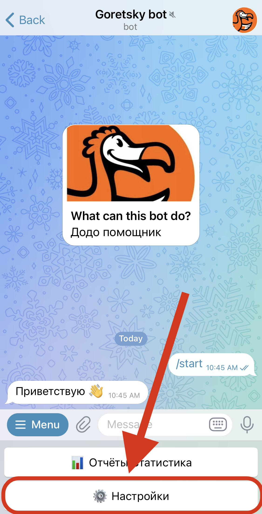
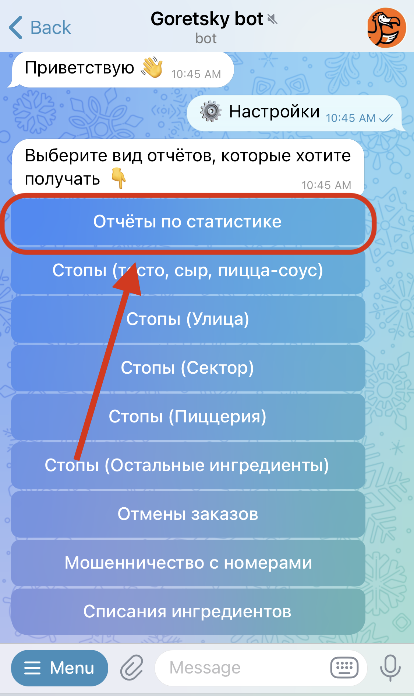
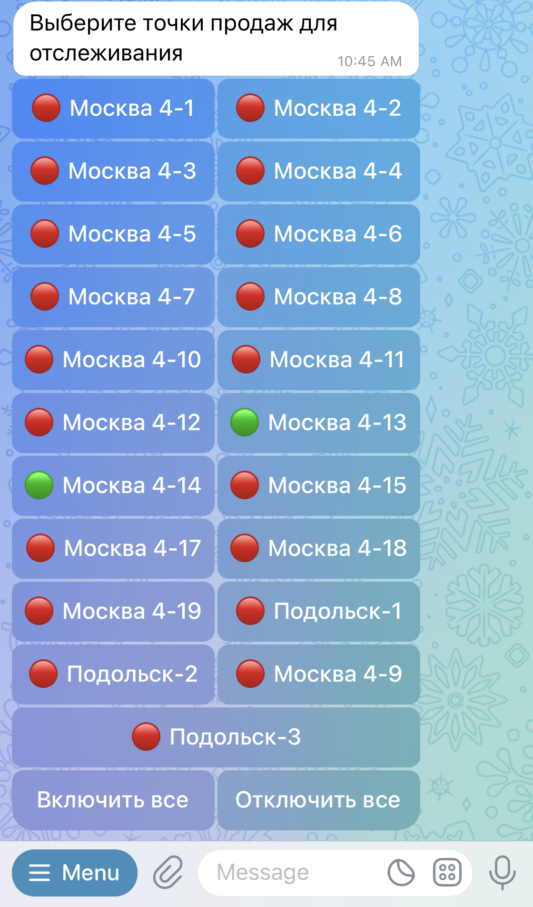

# Telegram Bot

## Развертывание и запуск

### Конфигурация
Создайте в корне проекта файл `config.toml`. 

Или можно скопировать файл `config.example.toml`.

```shell
cp config.example.toml config.toml
```

#### Описание параметров конфигурационного файла
- `logfile_path` - **опционален**. Путь до файла, в котором будут записываться логи приложения.
- `debug` - **debug** режим. Необходимо включать при разработке или в отладочных целях.
- `telegram_bot_token` - токен бота. Его можно получить у [BotFather](https://t.me/BotFather).
- `dodo_api_url` - HTTP URL сервиса [Dodo API](https://github.com/goretsky-integration/api).
- `database_api_url` - HTTP URL сервиса [Units-Routes](https://github.com/goretsky-integration/unit-routes-database).

### Запуск бота

Создание виртуального окружения
```shell
poetry env use python3.11
```

Активация виртуального окружения
```shell
poetry shell
```

Установка зависимостей
```shell
poetry install --without dev
```

Запуск
```shell
python src/main.py
```


## Описание функционала
Бот предоставляет данные из информационной системы Dodo (далее Dodo IS).
Данные могут быть в двух видах:
- отчёты
- уведомления

Для начала нужно настроить точки продаж, по которым вы хотите получать отчёты/уведомления.

Ниже показан порядок действий для настройки точек продаж для <b><u>отчётов</u></b>.
1. 
2. 
3. 
